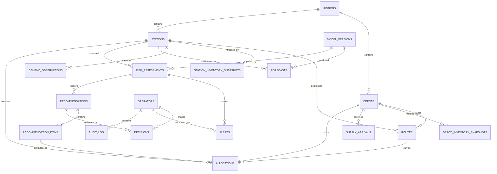

# ERD — Fuel Supply Intelligence & Resilience Platform

Canonical source: `PROBLEMSTATEMENT DOCS/erd.mermaid`. PostgreSQL; all `*_snapshots` / observations are append-only, keyed by simulator `tick`.

## Entities (grouped)

| Group | Entities | Purpose |
|---|---|---|
| World | `regions`, `depots`, `stations`, `routes` | Static network topology from the simulator |
| Snapshots | `depot_inventory_snapshots`, `station_inventory_snapshots`, `demand_observations`, `supply_arrivals`, `sim_events` | Per-tick state ingested from `/v1/*` |
| Intelligence | `model_versions`, `forecasts`, `risk_assessments`, `alerts` | Predictions, risk scoring, notifications |
| Decision | `recommendations`, `recommendation_items`, `decisions`, `allocations` | LP output → operator approval → simulator write |
| Ops | `operators`, `service_health_checks`, `fallback_events`, `benchmark_runs`, `audit_log` | Health, fallbacks, benchmarks, audit |

## Key columns

- **depots / stations** — mirror simulator fields incl. `jsonb capacity` per fuel; `status` (`OPEN/CONSTRAINED`, `OPEN/OUTAGE`).
- **routes** — `transit_ticks`, `max_shipment`, `status` (`AVAILABLE/DISRUPTED`).
- **forecasts** — `predicted_liters`, `lower_bound`, `upper_bound` per `station_id × fuel_type × target_tick`, linked to `model_versions`.
- **risk_assessments** — `hours_to_stockout`, `stockout_probability`, `severity` (LOW/MEDIUM/HIGH/CRITICAL), `confidence`, `jsonb signals`.
- **recommendations** — `policy` (heuristic/optimizer/fallback), `status` (PROPOSED/APPROVED/REJECTED/EXPIRED), `risk_before`, `risk_after`, `confidence`, `jsonb explanation/alternatives`, `expires_tick`.
- **recommendation_items** — one row per `depot_id → station_id` via `route_id`, `fuel_type`, `quantity`.
- **allocations** — mirror of simulator ledger; `idempotency_key` **unique**; `sim_allocation_id`; status PENDING/IN_TRANSIT/ARRIVED/FAILED/CANCELLED; `failure_reason`.
- **decisions** — `action` APPROVED/REJECTED/MODIFIED/AUTO by `operator_id`.
- **service_health_checks** — per component (backend/db/simulator/forecaster/planner): HEALTHY/DEGRADED/DOWN, `latency_ms`.
- **fallback_events** — `component`, `reason`, `fallback_policy`, started/ended.

## Diagram

## Lifecycle chain

`risk_assessment` → (severity HIGH/CRITICAL) → `alert` + `recommendation` (PROPOSED) → operator approves → `decision` (APPROVED) → `recommendation_items` become `allocations` (unique idempotency key) → simulator executes → `allocation.status` ARRIVED / FAILED → risk re-assessed.
