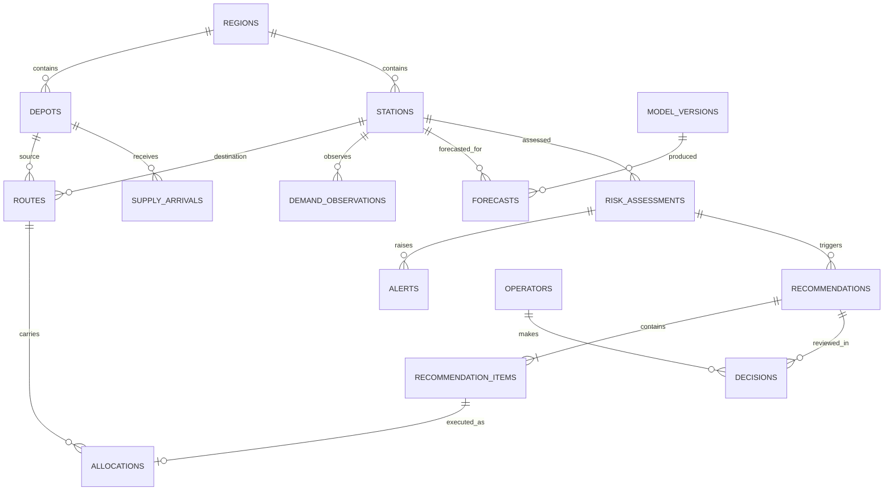

# PRD: Fuel Supply Intelligence & Resilience Platform

**Event:** BUP CSE Fest 2026, Hackathon Finals (with Poridhi.io)
**Stack:** Svelte (frontend), FastAPI (backend), PostgreSQL, Docker Compose, Prometheus + Grafana
**Status:** Draft v1

---

## 1. Overview

An operator-facing decision-support platform built on top of the organizer-provided **BUP Fuel Supply Simulator**. It observes the simulated Bangladeshi fuel network (2 regions, 2 depots, 4 stations, 6 routes, 3 fuels), detects emerging shortages, recommends allocations with explanations, executes approved decisions through `POST /v1/allocations`, and stays observable and usable when components fail.

The core loop is **Observe → Detect → Predict → Decide → Simulate → Act → Monitor → Recover**.

## 2. Goals and Non-Goals

**Goals**
- G1. Keep station `service_level` high and unmet demand low across normal operation and crises.
- G2. Give operators an inspectable view of state, risk, recommendations and decision history.
- G3. Demonstrate graceful degradation under simulator faults and internal service failures.
- G4. Provide evidence of deployment, observability, and load-test results.

**Non-Goals**
- Building our own fuel simulator or dataset.
- Modifying the simulator source.
- Controlling anything real; all actions are simulated.
- Enterprise-grade security, Kubernetes, or reinforcement learning (optional stretch only).

## 3. Users

| Persona | Needs |
|---|---|
| **Operations operator** | See risk fast, review a recommendation, approve or reject, track the shipment |
| **Operations lead / admin** | Audit decisions, switch policy, run the scenario lab, see system health |
| **Judge (evaluator)** | Understand system health and reasoning at a glance, trigger crises, observe recovery |

## 4. Key Simulator Constraints (design inputs)

- One write path: `POST /v1/allocations` (creates PENDING, departs next tick, depot deducted immediately, cancel only while PENDING).
- Validation errors are 409 with codes such as `ROUTE_DISRUPTED`, `INSUFFICIENT_INVENTORY`, `DISPATCH_CAPACITY_EXCEEDED`, `DESTINATION_CAPACITY_EXCEEDED`. The planner must mirror these checks before submitting.
- Idempotency keys are permanent, even after cancel.
- Tongi and Cox's Bazar have a single route each; Mirpur and Karnaphuli have slow cross-region alternatives (4 ticks, max 5,000).
- SSE is advisory only: no replay, a slow subscriber gets dropped, and REST is the source of truth.
- Faults (`latency`, `unavailable`, `error_rate`, `stale_data`, `stream_disconnect`) affect `/v1/*` but not `/admin/*` or `/v1/health`.

## 5. Functional Requirements

Priority: **P0** must ship, **P1** should ship, **P2** stretch.

### 5.1 Simulator Integration
| ID | Requirement | Pri |
|---|---|---|
| FR-1 | Typed client with timeouts, retries (backoff + jitter), and response validation for all `/v1/*` reads | P0 |
| FR-2 | Poll REST on each tick and use SSE (`simulation.tick`, `allocation.status_changed`, `inventory.updated`) as triggers, then refetch | P0 |
| FR-3 | Auto-reconnect SSE and fully resync state after any reconnect | P0 |
| FR-4 | Detect `X-Simulator-Stale: true` and mark data as stale in the UI | P1 |
| FR-5 | Deterministic idempotency keys per (tick, route, fuel, purpose) | P0 |

### 5.2 Operator Application (Svelte)
| ID | Requirement | Pri |
|---|---|---|
| FR-6 | **Network overview:** inventory gauges per station/depot/fuel with capacity, status badges, current tick and sim time | P0 |
| FR-7 | **Risk view:** hours-to-stockout and stockout probability per station/fuel, sorted by severity | P0 |
| FR-8 | **Alerts panel:** shortage, anomaly, disruption and system alerts with acknowledge | P0 |
| FR-9 | **Recommendations:** cards showing signals, constraints, expected impact (risk before → after), confidence, alternatives | P0 |
| FR-10 | Approve / reject / edit quantity, then submit; track allocation through PENDING → IN_TRANSIT → ARRIVED | P0 |
| FR-11 | Incoming supply, routes, in-transit shipments, active disruptions | P0 |
| FR-12 | Decision history and audit trail | P1 |
| FR-13 | Forecast vs actual demand charts | P1 |
| FR-14 | **System status page** (backend, DB, simulator, forecaster, planner, p95 latency, error rate) | P0 |
| FR-15 | **Scenario lab:** inject events and faults via `/admin/*`, step/pause/run, reset; admin-role only | P1 |
| FR-16 | Live updates via SSE from our backend, with degraded/cached banner | P0 |

### 5.3 Intelligence
| ID | Requirement | Pri |
|---|---|---|
| FR-17 | **Forecast:** per station/fuel demand from hour-of-day profile learned from `/demand-history`, scaled by a recent demand-multiplier estimate; backtested (MAPE) | P0 |
| FR-18 | **Anomaly detection:** CUSUM or z-score on observed/expected ratio to flag demand spikes | P0 |
| FR-19 | **Risk engine:** project inventory using forecast, in-transit shipments and scheduled supply; output hours-to-stockout and stockout probability (Monte Carlo) | P0 |
| FR-20 | **Planner v1:** priority-greedy allocation respecting all simulator constraints and the fastest feasible route | P0 |
| FR-21 | **Planner v2:** LP/MILP optimizer under the same constraints; compared against v1 | P1 |
| FR-22 | **Explanations:** structured reasons per recommendation (template), optional LLM narrative with template fallback | P1 |
| FR-23 | **Digital twin:** projection of expected impact before approval | P1 |
| FR-24 | **Benchmark harness:** reset with fixed seed and compare policies on `service_level`, unmet liters and failures | P1 |
| FR-25 | Confidence gating: low confidence routes the recommendation to human review | P0 |

### 5.4 Crisis Handling
| ID | Requirement | Pri |
|---|---|---|
| FR-26 | Shipment delay: detect the shifted arrival, recompute risk, show shortage impact and response | P0 |
| FR-27 | Demand spike: detect via anomaly, adapt the forecast, reprioritize allocations | P0 |
| FR-28 | Depot constraint: continue shipping, prioritize scarce stock by risk | P1 |
| FR-29 | Route disruption / station outage: exclude invalid options, reroute via alternatives where they exist, warn early where they do not | P0 |
| FR-30 | Combined crisis handled without invalid submissions | P1 |

### 5.5 Resilience
| ID | Requirement | Pri |
|---|---|---|
| FR-31 | Circuit breaker around the simulator client | P0 |
| FR-32 | Cached last-good state with age indicator when the simulator is unavailable | P0 |
| FR-33 | Model unavailable → fallback heuristic policy, recorded in `fallback_events` | P0 |
| FR-34 | Invalid simulator response → reject input, raise system alert | P0 |
| FR-35 | Every simulator fault type tested with documented behavior | P0 |
| FR-36 | Internal failure injection (kill forecaster/planner) with recovery shown | P1 |

### 5.6 Observability
| ID | Requirement | Pri |
|---|---|---|
| FR-37 | Prometheus metrics: request rate, latency, errors, simulator call latency/failures, forecast error, alert/decision counts, fallback activations, live `service_level` | P0 |
| FR-38 | Structured JSON logs with correlation IDs for decisions and integration failures | P0 |
| FR-39 | `/health/deep` reporting each component | P0 |
| FR-40 | Provisioned Grafana dashboards and a few alert rules | P1 |
| FR-41 | Distributed tracing (OpenTelemetry) | P2 |

### 5.7 Delivery
| ID | Requirement | Pri |
|---|---|---|
| FR-42 | `docker compose up` launches simulator, backend, frontend, DB, Prometheus, Grafana | P0 |
| FR-43 | CI: lint, tests, image build, compose smoke test with health check | P1 |
| FR-44 | Load test (k6 or Locust) on dashboard-state and decision endpoints; report avg/p50/p95/p99, throughput, error rate, concurrency, resource usage | P0 |
| FR-45 | Secrets via environment; `.env.example`; input validation; role-gated sensitive actions | P0 |

## 6. Non-Functional Requirements

- **Freshness:** UI reflects a new tick within about 2 seconds of the tick under normal load.
- **Decision latency:** recommendation generation p95 under 1 second for the full network.
- **Determinism:** the same seed and actions reproduce the same decisions (no unseeded randomness in planners).
- **Safety:** no allocation is submitted without operator approval unless auto-mode is explicitly enabled by an admin.
- **Honesty:** UI clearly labels all data as simulated.

## 7. Architecture

```
Simulator ──REST/SSE──► FastAPI backend ──► PostgreSQL
                         ├─ sim client (retry, breaker, cache)
                         ├─ ingest + snapshots
                         ├─ forecast / anomaly / risk engine
                         ├─ digital twin + planner (+ fallback policy)
                         ├─ decision workflow → POST /v1/allocations
                         └─ /metrics, /health/deep, SSE to UI
Svelte SPA ◄── REST + SSE ── backend
Prometheus + Grafana, k6/Locust, GitHub Actions
```

## 8. Data Model

The full ERD is in `erd.mermaid`. Summary:

- **World mirror:** `regions`, `depots`, `stations`, `routes`, `supply_arrivals`, `sim_events`, inventory snapshots, `demand_observations`
- **Intelligence:** `model_versions`, `forecasts`, `risk_assessments`, `alerts`
- **Decisions:** `recommendations`, `recommendation_items`, `decisions`, `allocations`, `operators`
- **Operations:** `service_health_checks`, `fallback_events`, `benchmark_runs`, `audit_log`



## 9. Backend API (ours)

| Method | Path | Purpose |
|---|---|---|
| GET | `/api/state` | Consolidated network state (with staleness flag) |
| GET | `/api/risks`, `/api/alerts` | Risk assessments and alerts |
| POST | `/api/alerts/{id}/ack` | Acknowledge alert |
| GET | `/api/forecast?station_id=&fuel_type=` | Forecast vs actual |
| GET | `/api/recommendations` | Open recommendations |
| POST | `/api/recommendations/{id}/approve` / `reject` | Operator decision |
| GET | `/api/allocations`, `/api/decisions` | Ledger and history |
| GET | `/api/stream` | SSE to the UI |
| GET | `/api/health`, `/health/deep`, `/metrics` | Health and observability |
| POST | `/api/policy` | Switch planner policy (admin) |
| POST | `/api/scenarios/*` | Scenario lab proxy to `/admin/*` (admin) |
| GET | `/api/benchmarks` | Policy comparison results |

## 10. Demo Script

1. Normal operations on the overview dashboard.
2. Trigger a demand spike in Dhaka; risk view turns amber.
3. Anomaly detected, shortage predicted, recommendation appears with explanation.
4. Operator inspects it, approves, and tracks the shipment.
5. Inject a route disruption; the system reroutes or warns early.
6. Inject a simulator fault (`error_rate`); banner shows cached/degraded mode.
7. Kill the forecaster; fallback policy activates and Grafana shows it.
8. Clear the faults; recovery is visible and operations continue.
9. Show the load-test report and the policy benchmark.

## 11. Milestones

| Phase | Deliverable |
|---|---|
| M0 | Repo, compose, simulator running, open questions answered |
| M1 | Simulator client, ingest, DB, state API |
| M2 | Overview dashboard (vertical slice) |
| M3 | Forecast, anomaly, risk engine, planner v1 |
| M4 | Recommendation and approval workflow, decision history |
| M5 | Crisis handling and scenario lab |
| M6 | Resilience behaviors and fault tests |
| M7 | Metrics, logs, health page, Grafana |
| M8 | Tests, CI, load test |
| M9 | Benchmark, diagrams, docs, demo rehearsal |

## 12. Success Metrics

- `service_level` of the recommended-policy run beats the do-nothing baseline on the standard seed, and beats the heuristic if the optimizer ships.
- Zero invalid allocation submissions (no 409s from checks we could have made).
- Forecast MAPE reported on backtest.
- Load-test report with p50/p95/p99 and error rate.
- Every simulator fault type has a documented, demonstrated behavior.

## 13. Risks and Mitigations

| Risk | Mitigation |
|---|---|
| Guide ambiguities (idempotency status code, dispatch-capacity check) | Probe empirically in M0 and encode as tests |
| Fast tick rate outpaces decisions | Step/pause for testing; slow demo speed; async pipeline |
| Organizer surprise events | Generic event handling driven by `/v1/events`, not hard-coded scenarios |
| Scope creep (K8s, RL) | Stay with P0/P1; stretch only after M8 |
| Single-route stations cannot be rerouted | Early warnings and pre-positioning logic; state this limit explicitly in the demo |

## 14. Open Questions

- Team size and available build hours (drives phase scheduling).
- Whether an LLM API key is available for explanation narratives.
- Whether judges will run against our compose file or a hosted instance.
- Whether the simulator's region `demand_factor` applies multiplicatively to profile demand.

## 15. Assumptions

- The simulator image and baseline scenario run as documented.
- All data is simulated; no real infrastructure is touched.
- Operators are authenticated with simple role-based access (viewer, operator, admin).
